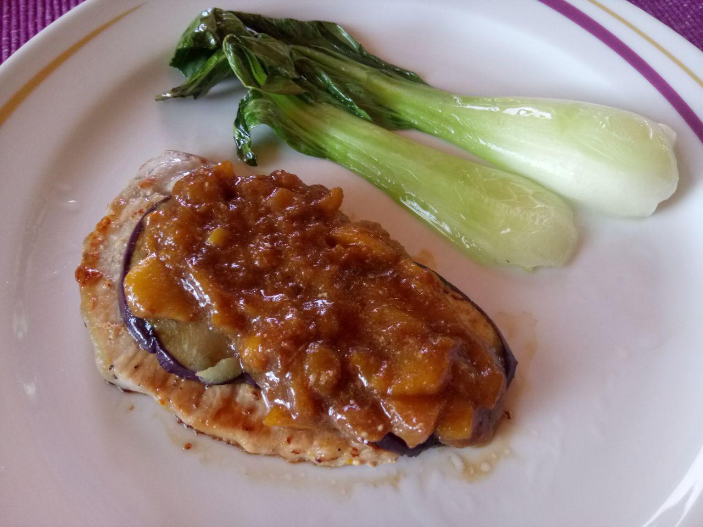

# Mini-Steak with Eggplant, Peach-Balsamic Sauce and Pak Choi
From the girl who made the Cocoa-Biscuit Cake with Marshmallow-Cheese Creme popular: A new wonderful recipe that will make your tongue feel like a virgin princess who never explored her taste!

## What you need:
- Coconut Oil (Properly one that didn't got other ingredients to make it liquid. Real Coconut Oil is pretty solid.)
- Balsamic-Vinegar
- Soy Sauce
- 3 Mini-Steaks
- 1 Peach
- 1 Pak Choi
- 1 Eggplant
- 1 Milk (Wait. Milk doesn't come in this shape.)

## How to cook it:

1. Wash the Pak Choi under cold water.

2. Part the Pak Choi at the bottom so you have multiple long pieces with a little leaf-like end.

3. Cut the peach into thin slices and then into many small pieces.

4. Heat a little pot and an additional pan with some coconut oil (this is important for the taste).

5. Put the peach pieces in the pot when the coconut oil is completely liquid and almost hot.

6. Add salt to the peaches and let them cook for a couple of minutes.

7. Now put the Pak Choi into the pan and let them fry slightly for 2 - 3 minutes.

8. Replace the Pak Choi with your mini-steaks and put the Pak Choi aside.

9. Cut the eggplant into a couple of thin slices, put them on a piece of paper towel and salt the slices.

10. Pour a good amount of balsamic-vinegar on your peach pieces, mix it up a bit and let them cook again.

11. When the mini-steaks are slightly brown on the current side, turn them around and put the eggplant slices into the pan between your steaks.

12. Add 4 - 5 drops of soy sauce to your peach sauce.

13. Mash your peaches with a special tool or a big spoon and mix it up again.

14. When your mini-steaks and eggplant slices are almost done, add a little bit of milk to your peach sauce and mix it again until you can hardly see the original color of the milk.

15. Place your mini-steaks and Pak Choi on a plate and put your eggplant slices on top of the steaks.

16. Add a good amount of the thickened peach sauce on top of the steaks.

17. You are done and can invite a friend to share the wonderful taste now.

